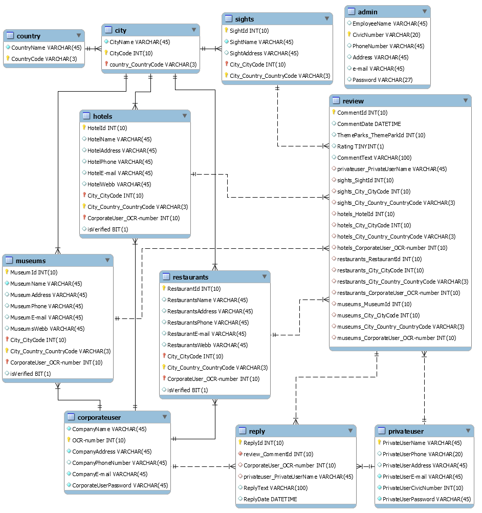
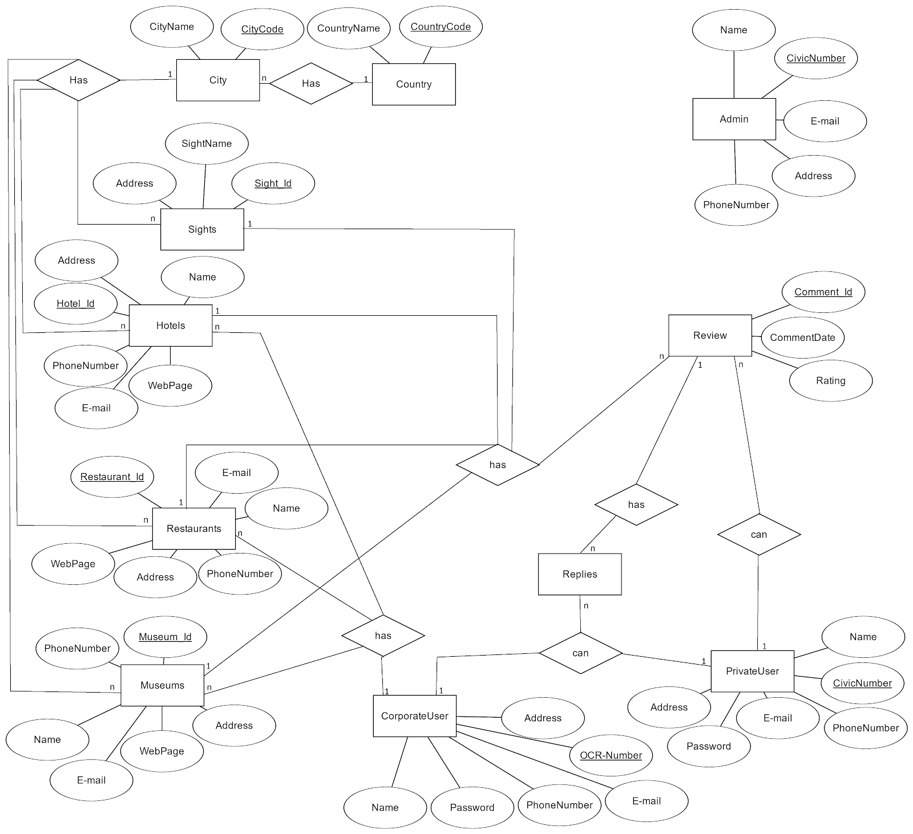

# Nordic-Guide

## Project information
```
IDE: IntelliJ IDEA
Programming language: Java
```

## Description
```
A PC application similar to existing website tripadvisor where hotels and other types of attractions can publish events or hotel rooms to make it accessable for tourists. 
The development group included four students and was developed during the course - at Högskolan Kristianstad. 
```

## Learning outcomes
```
*Waterfall workflow 
*JavaFX Scenebuilder
*MySQL Database
*MVC Design Pattern
```


# EER-Diagram & ER-Diagram




